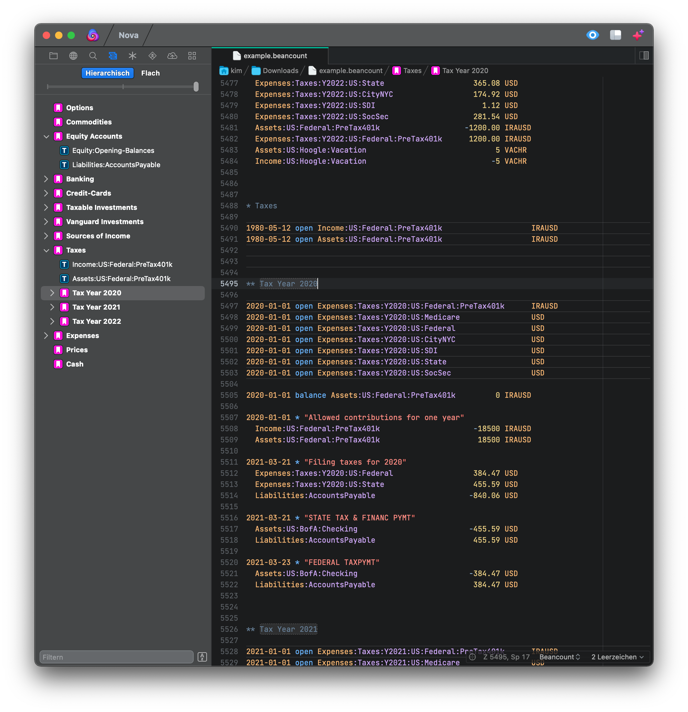

# Beancount Nova Extension

**Beancount** provides syntax highlighting and autocompletion for **Beancount** plain text accounting files for [Nova](http://nova.app).

## Language Support

This plugin currently implements Syntax highlighting for the full Beancount v2 syntax. If you encounter any issues

Autocompletion support is pretty rudimentary at the moment. Tags and links can be completed and accounts can be completed in transactions but not elsewhere.
